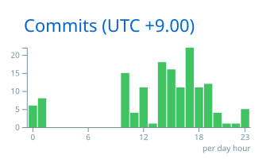

  

  

    Building reliable products with Ruby on Rails, React, C#, and cloud platforms.
  

  

    
    &nbsp;&nbsp;
    
  

  

## Tech Stack

### Languages

  
  
  
  
  
  
  

### Frameworks / Libraries

  
  
  
  
  
  

### Cloud / Infra

  
  
  
  

## Certifications

  
  

## Stats ✍️

  
  

  Auto-updated every 12 hours via GitHub Actions.

